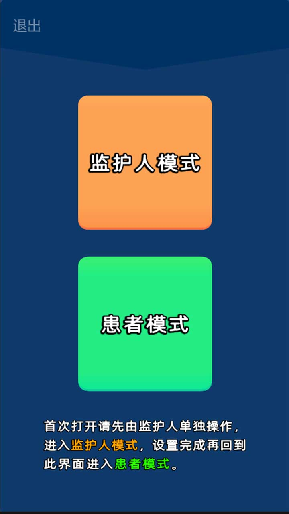
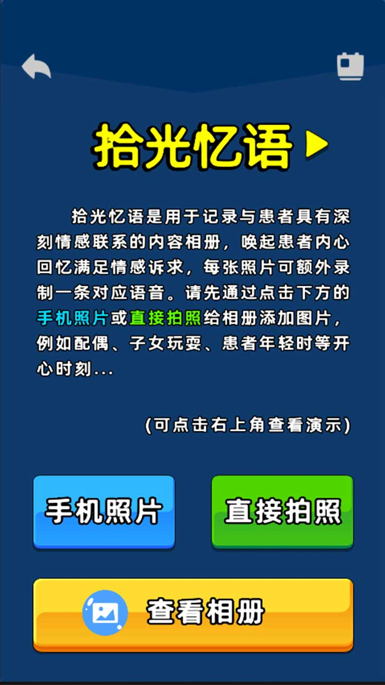
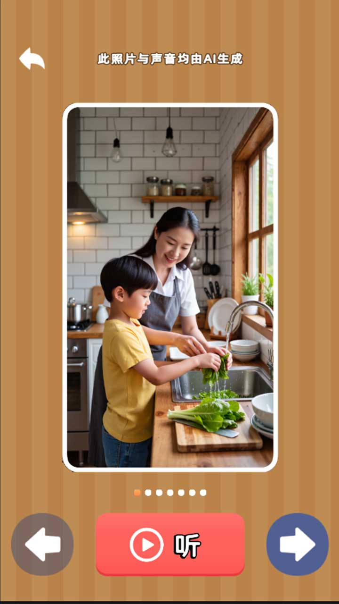
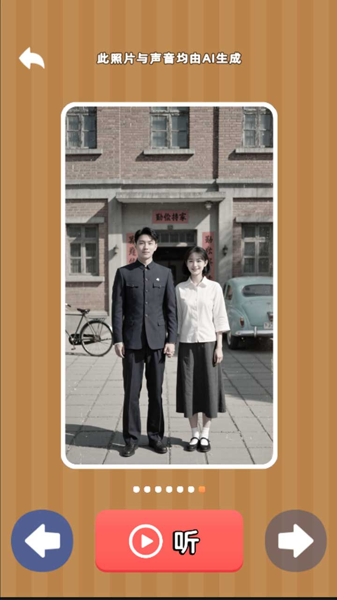
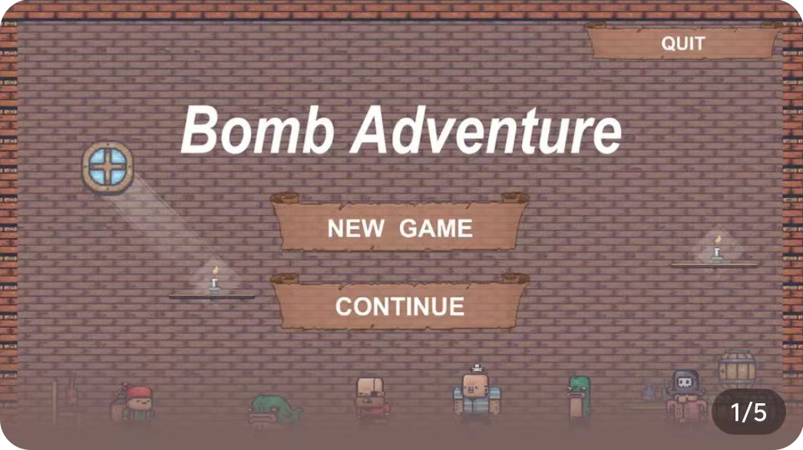

# This-is-me
# 🎨 我的作品集 

> 本页面收录了我的部分设计与开发作品，包含图片、视频与外部链接。  
> 如果访问 GitHub 较慢，请使用国内镜像（Gitee）：  
> **🔗 [Gitee 镜像地址](https://gitee.com/Liu-Xuan-24/This-is-me)**

## 🎮 游戏作品

> 以下是我独立设计/开发的游戏作品，进入“官网链接”可获取试玩方式。

---

### 🕹 拾光忆语(已上线)
- **完成时间**：2025年7月
- **游戏首页**：

  
  
  
  

- **内容描述**：
  《拾光忆语》是一款聚焦阿尔兹海默症患者家庭的公益游戏，采用数字化的“怀-旧疗法”守护珍贵记忆。我们独创了“亲声”陪伴系统，将家人亲录的声音与充满情感的照片深度绑定，创造出“音画一体”的沉浸式回忆体验，实现超时空情感陪伴，游戏内每一个细节都为用户群体量身打造。此外，我们借用AI绘图和AI语音大模型设计了期望内容的演示模式，供用户家人参考。我们希望《拾光忆语》能让患者逐渐恢复记忆，恢复情感，恢复自己！
- **官网链接**：
  [TapTap网页版](https://www.taptap.cn/app/768171)

---

### 🕹 炸弹冒险
- **完成时间**：2020年9月
- **游戏首页**：
- **内容描述**：
  你是一名海盗，但在旅行时被其他海盗抓到他们的巢穴，你携带着可以放置炸弹的包裹，但他们都同样有着针对炸弹的不同技能，将他们都击退吧，成为最强海盗！
- **官网链接**：
  [TapTap网页版](https://www.taptap.cn/app/199668)

---

---

## 📷 游戏作品（图片）
| 作品 | 预览 | 简介 |
|------|------|------|
| 作品1标题 |  | 这里是作品1的简短说明（功能亮点/设计风格等） |
| 作品2标题 |  | 这里是作品2的简短说明 |
| 作品3标题 |  | 这里是作品3的简短说明 |

---

## 🎬 视频演示
> 点击缩略图查看完整视频（建议上传到 Bilibili / YouTube）
| 项目 | 预览图（可点击） | 简介 |
|------|----------------|------|
| 视频1标题 |  | 这里写视频的亮点描述 |
| 视频2标题 |  | 这里写视频的亮点描述 |

---

## 🔗 外部链接
- [个人博客 / 网站](https://你的域名)
- [Behance 主页](https://www.behance.net/你的主页)
- [Dribbble 主页](https://dribbble.com/你的主页)
- [LinkedIn 主页](https://www.linkedin.com/in/你的主页)

---

## 📩 联系我
- **邮箱**：your.email@example.com  
- **微信**：你的微信号（可选）  
- **GitHub**：[https://github.com/你的用户名](https://github.com/你的用户名)  

---

*✨ 提示：图片建议宽度不超过 800px，视频缩略图建议 16:9 方便点击；GitHub 不支持直接播放视频，建议用 GIF 或缩略图链接跳转。*
