# This-is-me
# 🎨 刘炫的线上简历 2000.11

> 本页面收录了我的部分设计与开发作品，包含图片、视频与外部链接。  
> 如果访问 GitHub 较慢，请使用国内镜像（Gitee）：  
> **🔗 [Gitee 镜像地址](https://gitee.com/Liu-Xuan-24/This-is-me)**

## 🎓 教育背景 🚩中共党员

### 📖 研究生 
- **学校**：吉林大学 
- **专业**：计算机科学与技术学院-计算机专硕  
- **就读时间**：2023年9月 ~ 2026年6月 
- **研究方向**：图神经网络、分子属性预测、分子表示学习

### 📖 本科（16岁）
- **学校**：金陵科技学院  
- **专业**：计算机学院-数字媒体技术  
- **就读时间**：2017年9月 ~ 2021年6月  
- **学习重点**：Unity游戏开发与设计

## 🎮 游戏作品

> 以下是我独立设计/开发的游戏作品，进入“官网链接”可获取试玩方式。

### 🕹 拾光忆语(已上线)
- **完成时间**：2025年7月
- **游戏截图**：

  
  
  
  

- **内容描述**：
  《拾光忆语》是一款聚焦阿尔兹海默症患者家庭的公益游戏，采用数字化的“怀-旧疗法”守护珍贵记忆。我们独创了“亲声”陪伴系统，将家人亲录的声音与充满情感的照片深度绑定，创造出“音画一体”的沉浸式回忆体验，实现超时空情感陪伴，游戏内每一个细节都为用户群体量身打造。此外，我们借用AI绘图和AI语音大模型设计了期望内容的演示模式，供用户家人参考。我们希望《拾光忆语》能让患者逐渐恢复记忆，恢复情感，恢复自己！
- **官网链接**：
  [TapTap网页版](https://www.taptap.cn/app/768171)

---

### 🕹 炸弹冒险(已上线)
- **完成时间**：2020年9月
- **游戏首页**：
- **内容描述**：
  你是一名海盗，但在旅行时被其他海盗抓到他们的巢穴，你携带着可以放置炸弹的包裹，但他们都同样有着针对炸弹的不同技能，将他们都击退吧，成为最强海盗！
- **官网链接**：
  [TapTap网页版](https://www.taptap.cn/app/199668)

  ---

### 🕹 喧闹小镇(本科毕业设计)
- **完成时间**：2021年6月
- **内容描述**：
  由于当年糖豆人非常火爆，突发奇想决定模仿作为毕业设计，游戏内除人物外所有模型都是PS+C4D绘制。
- **游戏截图**：

  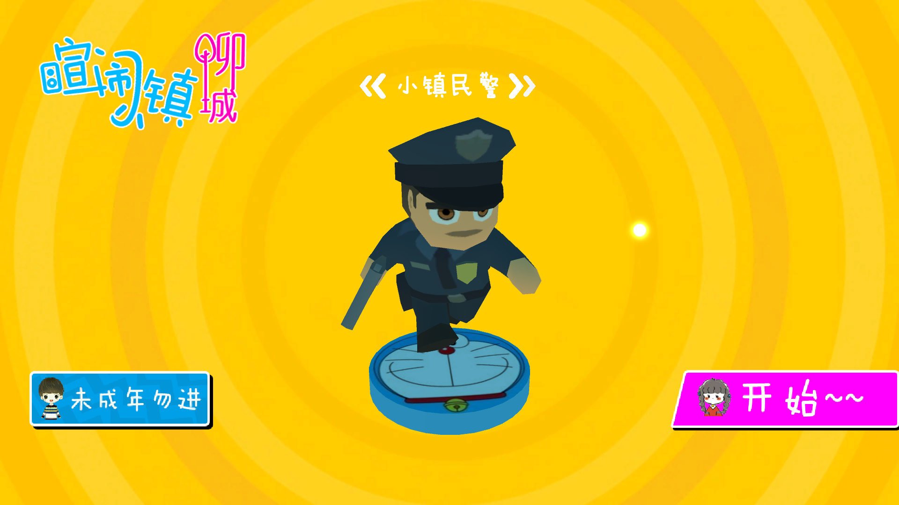
  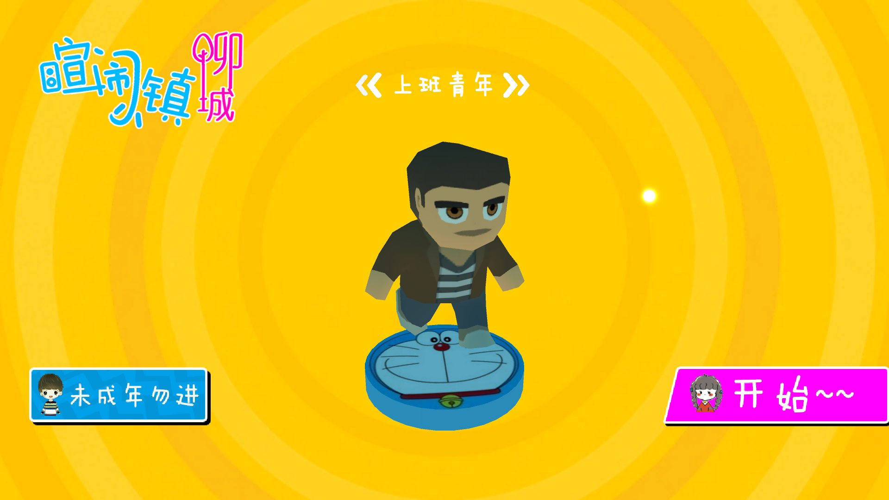
  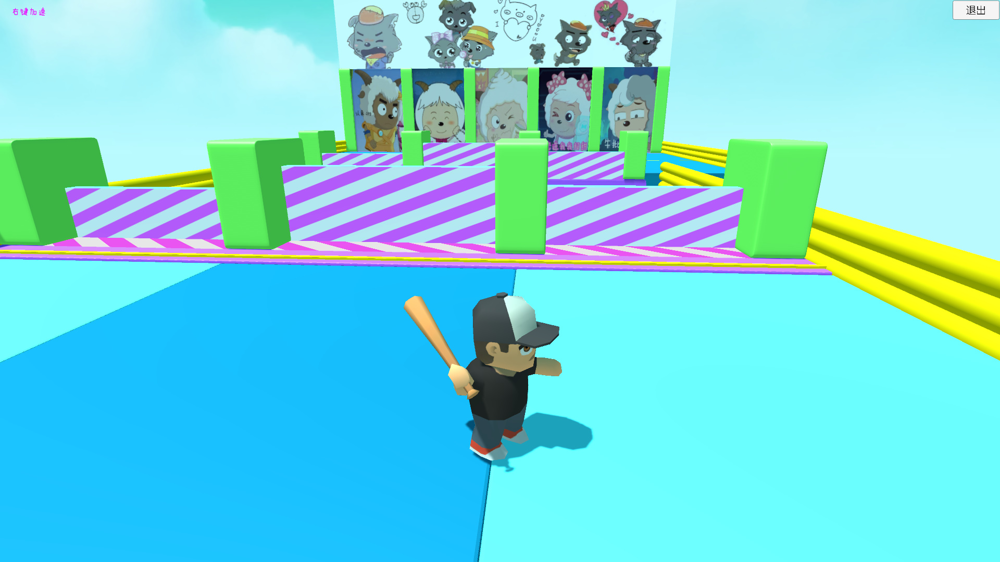
  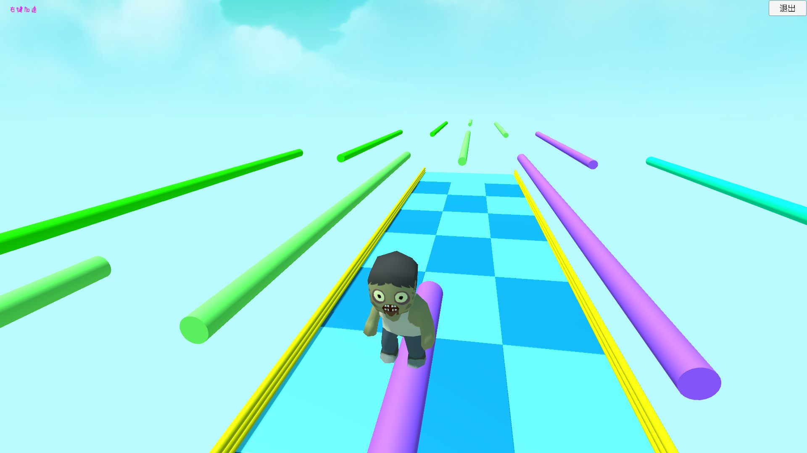

### 🕹 玩吧(游戏课程设计)
- **完成时间**：2019年10月
- **内容描述**：带组制作的一个游戏网站，负责Axure的全部内容
- **游戏截图**：

  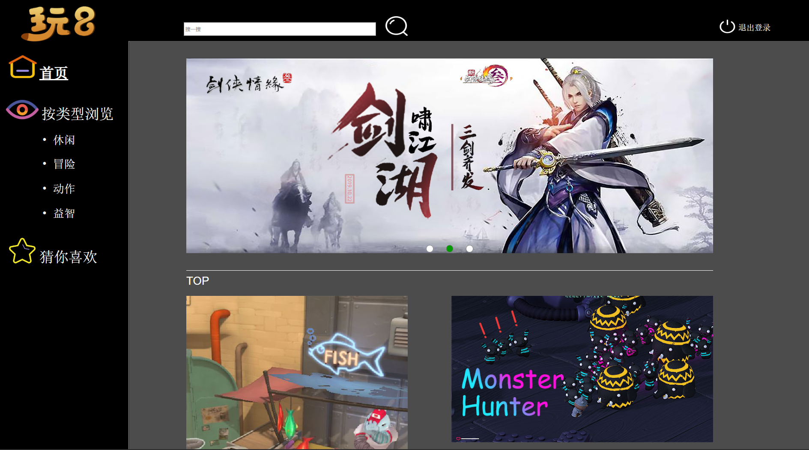

### 🕹 AE骨骼动画
- **完成时间**：2018年10月
- **内容描述**：自学PSPRAE等设计软件，在对动画有浓厚兴趣的驱使下完成
- **游戏视频**：

https://github.com/user-attachments/assets/206bd2f7-f6fb-4dd4-b22d-2fca9393d0d1

## 💼 工作项目

> 以下为我在不同公司期间参与的代表性项目，包含图片与视频展示。

### 🏢 公司名称 - 福建新大陆 - 大数据业务产品部 - 3D开发工程师
- **工作时间**：2021年7月 ~ 2021年10月
- **完成项目名称**：无锡物联网展

- **📷 项目展示图片**：

  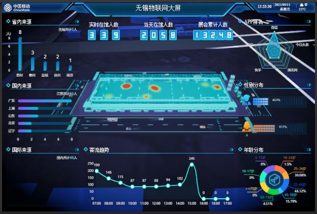
  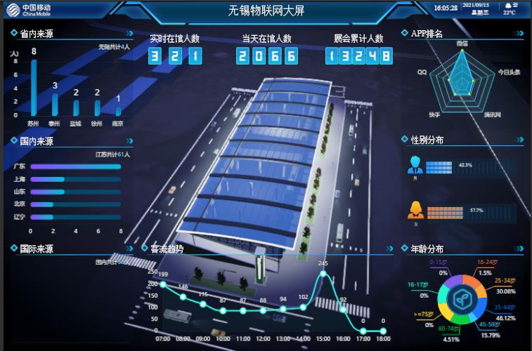

**📷 项目职责**  

制作整个项目除建模以外的所有3D部分，包含：获取后端场馆人数实时更新热力图、嵌入前端网页同步更新画面、场馆漫游、手控镜头。
技术：Unity，C#，简单Shader

---

### 🏢 公司名称 - 南京天吾信息技术 - Unity开发
- **工作时间**：2022年2月 ~ 2023年6月
- **完成项目名称**：南京信息工程大学-发电站自动化虚拟仿真、徐州工程学院-混凝土工艺虚拟仿真

- **📷 项目展示图片**：

  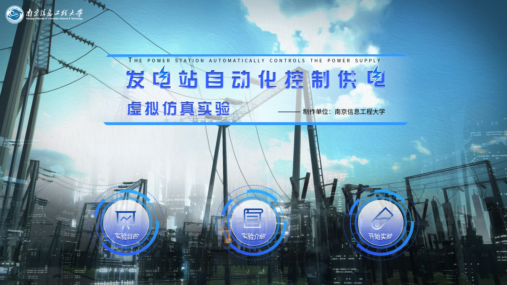
  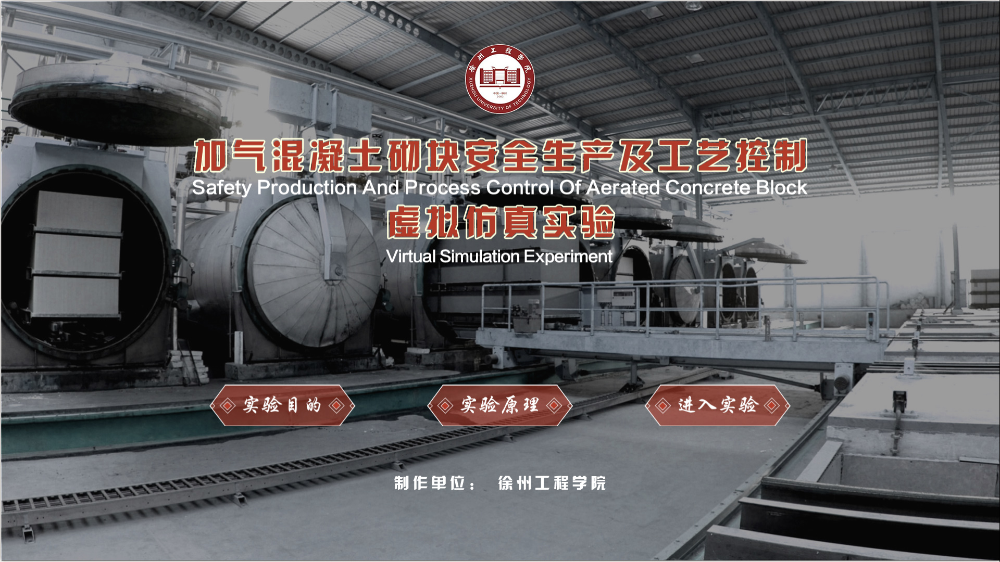

**🎬 项目展示视频**  

https://github.com/user-attachments/assets/4003338d-85ab-4650-b99e-4218bf029ea1

**📷 项目职责**  

整个项目中除建模UI以外的所有其他部分。

## 📚 论文发表

> 以下为我发表的学术论文。

### 📝 DFusMol: predicting molecular properties based on dual-channel attention (独立一作)
- **发表时间**：2025年7月30日
- **发表期刊/会议**：Frontiers in Molecular Biosciences 
- **分区**：SCI 2区 IF=4.0(2025)
- **Key Words**：multi-modality learning, molecular property prediction, graph neural networks, transformer
- **DOI**：[https://doi.org/10.3389/fmolb.2025.1623620](https://doi.org/10.3389/fmolb.2025.1623620)

## 🏆 比赛&奖项

> 以下为我在学习期间参加的比赛与获得奖项。

- **2025年**：2025-2026年度学业奖学金
- **2020年10月**：全国3D大赛江苏赛区一等奖（团队，队长身份）
- **2017年10月**：穿越火线手游高校联赛南京市亚军

  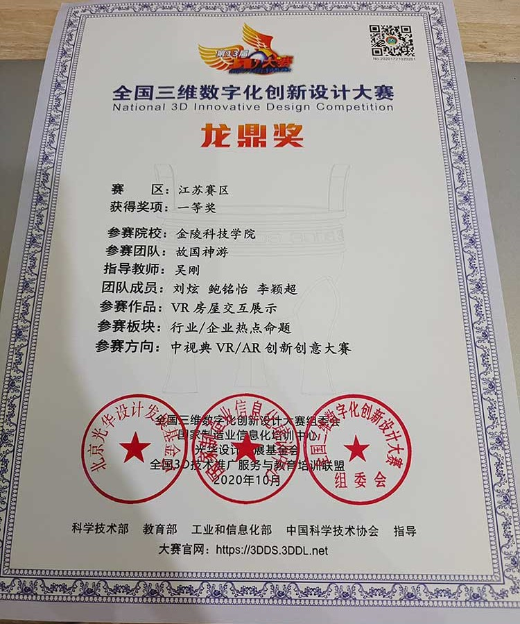
  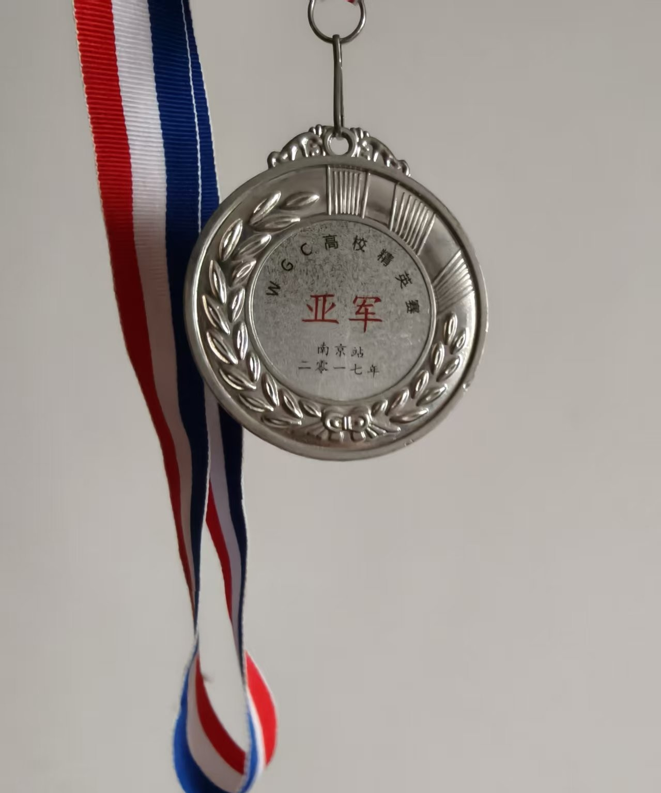

## 🔗 外部链接
- [个人博客 / 网站](https://jlu2023.love)

## 📩 联系我
- **邮箱**：liuxuan0011@qq.com  
- **GitHub**：[https://github.com/Fireflower-March](https://github.com/Fireflower-March)  

